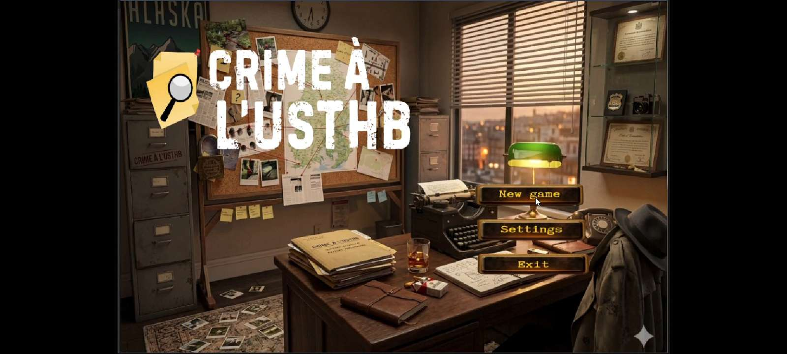
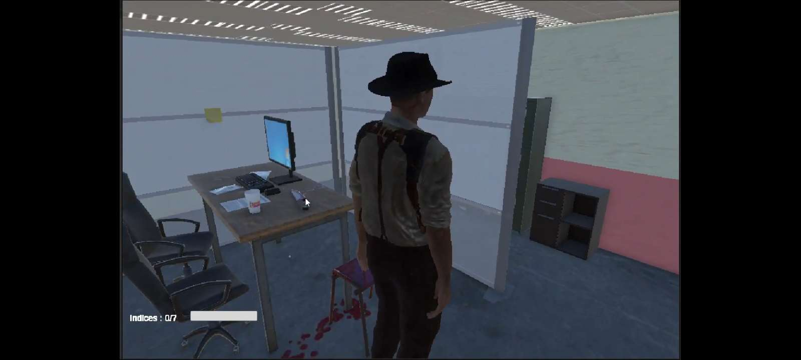
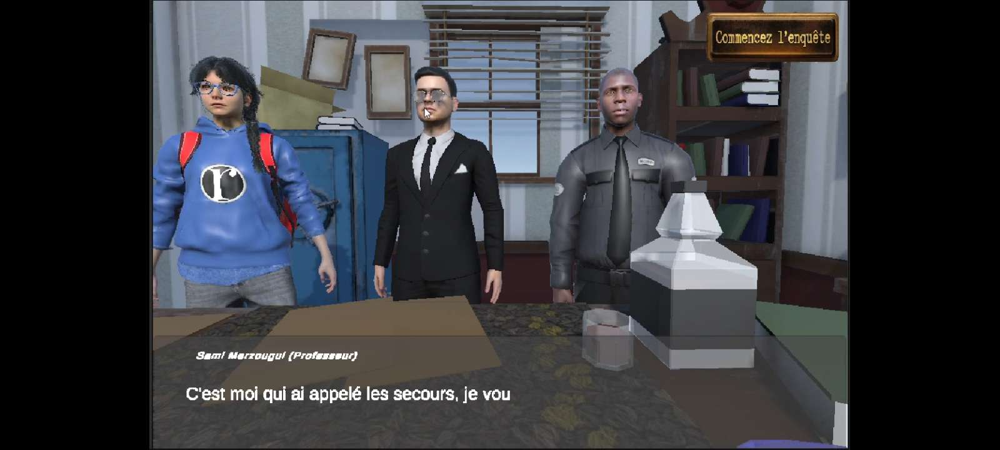
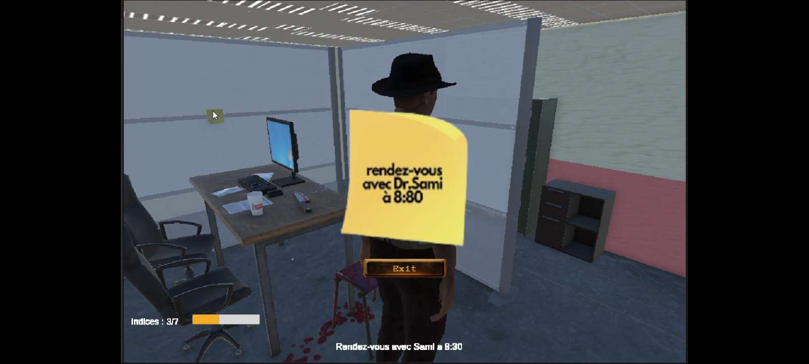
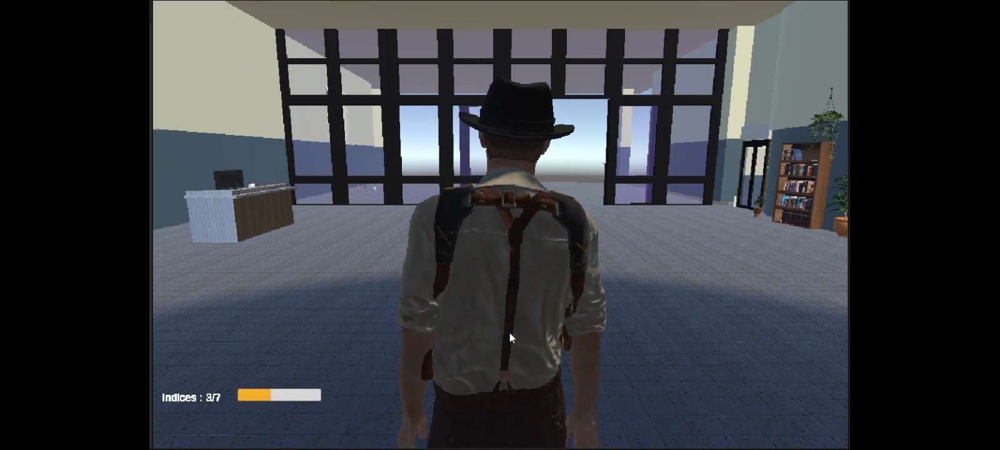
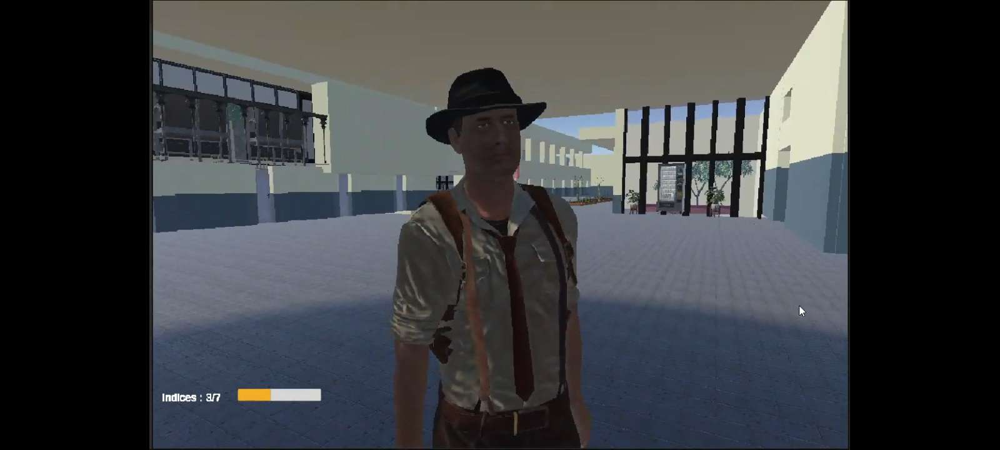
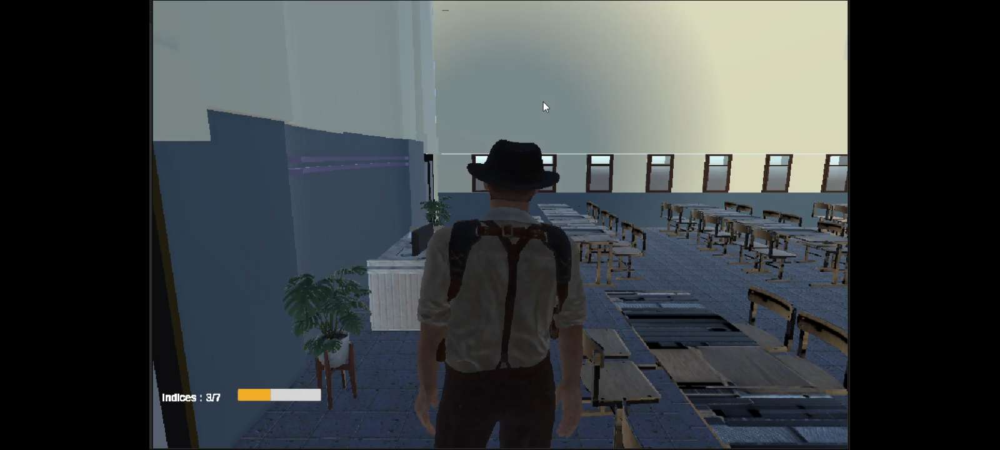
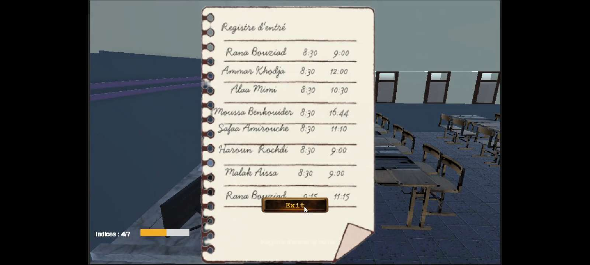
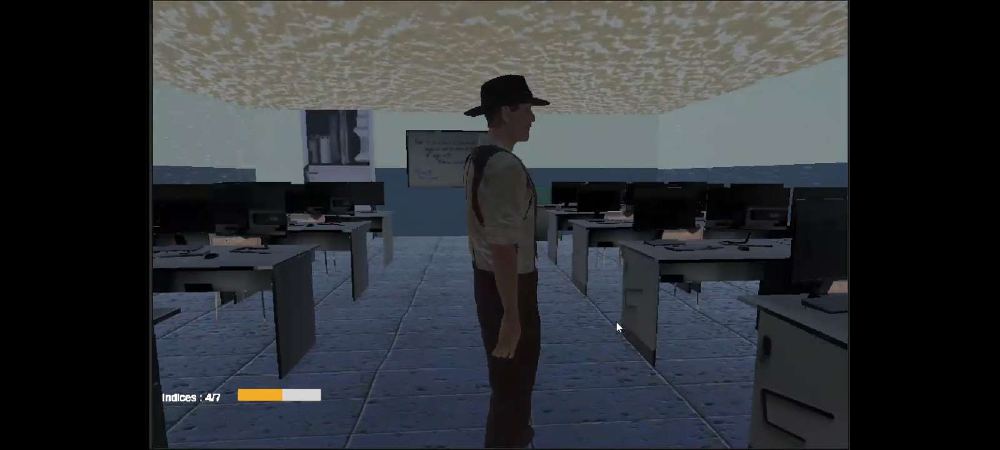
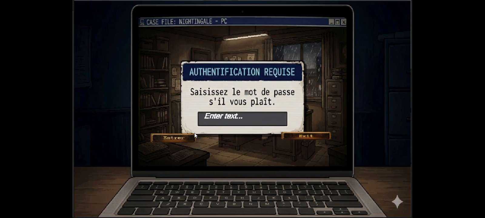

# Crime-à-l'USTHB

Crime-à-l'USTHB est un jeu vidéo d'enquête en 3D développé avec **Unity** et **Blender**. Le projet plonge le joueur dans une enquête criminelle se déroulant au sein de l'USTHB, où il devra explorer l'environnement, rechercher des indices et résoudre l'affaire grâce à ses capacités d'observation et de déduction.

## Description

Le jeu a été conçu dans le but de reproduire une expérience d'investigation immersive dans un environnement universitaire. Le joueur évolue dans un monde 3D inspiré du campus de l'USTHB et interagit avec différents éléments du décor afin de recueillir des informations essentielles à la progression de l'enquête.

L'ensemble des modèles 3D et des éléments visuels a été réalisé avec **Blender**, tandis que la logique du jeu, les interactions, les déplacements du personnage et l'interface utilisateur ont été développés sous **Unity** en utilisant le langage **C#**.

## Fonctionnalités

- Exploration d'un environnement 3D interactif.
- Système de collecte d'indices.
- Interactions avec des objets du décor.
- Progression basée sur la résolution d'une enquête.
- Interface utilisateur dédiée au suivi de l'investigation.
- Ambiance immersive inspirée du campus universitaire.

## Technologies utilisées

- Unity
- C#
- Blender
- Modélisation 3D
- Game Design

## Compétences mises en œuvre

- Développement de jeux vidéo.
- Programmation orientée objet en C#.
- Création et intégration d'assets 3D.
- Conception d'interfaces utilisateur.
- Gestion des interactions et événements.
- Conception de mécaniques de gameplay.

## Galerie

<table>
  <tr>
    <td align="center">
       
      Menu principal
    </td>
    <td align="center">
       
      Dialogue avec les suspects
    </td>
  </tr>
  <tr>
    <td align="center">
       
      Scène de crime
    </td>
    <td align="center">
       
      Authentification sur un ordinateur
    </td>
  </tr>
  <tr>
    <td align="center">
       
      Registre d'entrée, un indice à analyser
    </td>
    <td align="center">
       
      Hall d'entrée du bâtiment
    </td>
  </tr>
  <tr>
    <td align="center">
       
      Note trouvée pendant l'enquête
    </td>
    <td align="center">
       
      Salle informatique
    </td>
  </tr>
  <tr>
    <td align="center">
       
      Salle de classe
    </td>
    <td align="center">
       
      Extérieur du campus
    </td>
  </tr>
</table>

## Aperçu du projet

Le projet est disponible via le lien suivant :

📂 https://drive.google.com/drive/folders/1UWAdA9ZhEsfl-S6N9jCoHgZmjT4SK01c?usp=sharing

## Auteur

Projet réalisé dans le cadre d'un parcours universitaire à l'USTHB par Djaoud Khadidja et Gharbi Feriel

